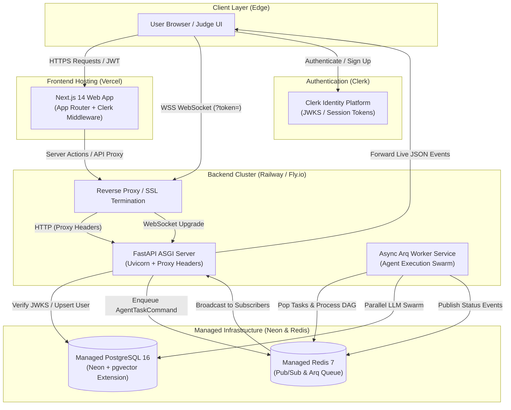

# Quorum

> Multi-agent AI research and report-generation platform.

[](https://quorum-research.vercel.app)
[-success?logo=fastapi)](https://api.quorum-research.up.railway.app/health)
[](https://api.quorum-research.up.railway.app/docs)

**Public Live URL**: [https://quorum-research.vercel.app](https://quorum-research.vercel.app)  
**Backend API**: [https://api.quorum-research.up.railway.app](https://api.quorum-research.up.railway.app) (Health: `/health`, Docs: `/docs`)

## Prerequisites

Ensure you have the following installed on your system:

- **Node.js**: `v20.x` or later (tested on Node `v24+`) and `npm`
- **Python**: `3.11` or later (with [`uv`](https://github.com/astral-sh/uv) recommended)
- **Docker & Docker Compose**: For containerized local development and databases
- **Git**

---

## Getting Started

### 1. Environment Configuration

Copy the example environment file and fill in the required API keys and credentials:

```bash
cp .env.example .env
```

---

## Running with Docker Compose

Spin up the entire stack (PostgreSQL with `pgvector`, Redis, FastAPI backend, and Next.js frontend):

```bash
# Start all services
docker compose up --build

# Or run in detached mode
docker compose up -d

# To spin up only database and cache:
docker compose up -d postgres redis
```

Services will be accessible at:
- **Web Frontend**: [http://localhost:3000](http://localhost:3000)
- **FastAPI Backend**: [http://localhost:8000](http://localhost:8000)
- **FastAPI Interactive Docs**: [http://localhost:8000/docs](http://localhost:8000/docs)
- **PostgreSQL (pgvector)**: `localhost:5432`
- **Redis**: `localhost:6379`

---

## Running Independently for Local Development

### Backend (`apps/api`)

1. Navigate to the API directory:
   ```bash
   cd apps/api
   ```
2. Sync dependencies using `uv`:
   ```bash
   uv sync
   ```
3. Start the FastAPI development server:
   ```bash
   uv run uvicorn src.main:app --reload --port 8000
   ```
4. Verify backend health:
   ```bash
   curl http://localhost:8000/health
   # Returns: {"status":"ok"}
   ```

### Frontend (`apps/web`)

1. Navigate to the Web directory:
   ```bash
   cd apps/web
   ```
2. Install dependencies:
   ```bash
   npm install
   ```
3. Start the Next.js development server:
   ```bash
   npm run dev
   ```
4. Open [http://localhost:3000](http://localhost:3000) in your browser.

### Shared Types (`packages/shared-types`)

To build or check types across the monorepo:
```bash
cd packages/shared-types
npm run typecheck
```

---

## Monorepo Structure

```text
quorum/
├── apps/
│   ├── web/               # Next.js 14 frontend (App Router, TypeScript, Tailwind CSS)
│   └── api/               # FastAPI backend (Python 3.11+, uv, subpackages for agents & workers)
├── packages/
│   └── shared-types/      # TypeScript types shared between web and Node tooling
├── infra/
│   ├── docker-compose.yml # Compose config for infrastructure services (API, worker, DB, Redis)
│   └── migrations/        # Database migrations placeholder
├── docker-compose.yml     # Root-level docker compose orchestration
├── .env.example           # Canonical environment variable template
├── .gitignore             # Root gitignore
└── README.md              # Project documentation
```

---

## 🚀 Live Demo & Deployment URLs

| Service | Environment | Platform | URL / Endpoint |
|---|---|---|---|
| **Web Application** | Production | **Vercel** | [https://quorum-research.vercel.app](https://quorum-research.vercel.app) |
| **Backend REST API** | Production | **Railway / Fly.io** | [https://api.quorum-research.up.railway.app](https://api.quorum-research.up.railway.app) |
| **API Health Check** | Production | **Railway / Fly.io** | [https://api.quorum-research.up.railway.app/health](https://api.quorum-research.up.railway.app/health) |
| **Interactive API Docs** | Production | **Swagger / OpenAPI** | [https://api.quorum-research.up.railway.app/docs](https://api.quorum-research.up.railway.app/docs) |
| **WebSocket Stream** | Production | **ASGI / WSS** | `wss://api.quorum-research.up.railway.app/ws/reports/{id}` |

---

## 🏛️ Architecture & Deployed Topology

Quorum is built as a resilient, distributed multi-agent system designed for asynchronous long-running research workflows. The deployed topology decouples web rendering, API routing, asynchronous worker swarms, pub/sub streaming, and persistent storage:



### 1. Frontend Web App (Vercel)
- **Framework**: Next.js 14 App Router with React Server Components, TanStack Query, and Zustand.
- **Styling**: Light/dark design system built on CSS variables, Tailwind CSS, and Framer Motion micro-animations.
- **Edge Middleware**: Clerk middleware protecting the `(dashboard)` route group, ensuring only authenticated users access active research projects.
- **Client Networking**: `api-client.ts` automatically attaches Clerk bearer tokens to REST calls and appends session tokens as query parameters on WebSocket connections (`/ws/reports/{id}?token=...`).

### 2. Backend REST & WebSocket Server (FastAPI on Railway / Fly.io)
- **ASGI Server**: Uvicorn running with `--proxy-headers --forwarded-allow-ips "*"` for transparent header handling behind cloud load balancers.
- **Release Automation**: Runs `alembic upgrade head` before booting to guarantee database schema synchronization.
- **Health Checks**: `GET /health` responding `200 OK` (`{"status":"ok"}`) utilized by deployment orchestrators for zero-downtime rolling updates.
- **Multi-Instance WebSocket Handling**: WebSocket subscribers connect to any backend instance. Live updates are pushed across instances via Redis Pub/Sub (`report:{id}:events`), preventing sticky-session coupling.

### 3. Asynchronous Worker Swarm (Separate Arq Process)
- **Isolation**: Long-running LLM research tasks are decoupled from the HTTP server into a dedicated `worker` process (`python -m src.workers.main`).
- **Orchestration**: Executes the multi-agent DAG:
  - **OrchestratorAgent**: Decomposes queries into parallel subtopics.
  - **ResearcherAgent Swarm**: Dispatches concurrent workers to synthesize facts and gather sources.
  - **FactCheckerAgent**: Detects contradictions and scores claim confidence.
  - **WriterAgent**: Persists structured report sections into PostgreSQL.
- **Fault Tolerance**: Circuit breaker tripping on 3 consecutive provider failures with exponential backoff and provider fallback (`Anthropic` -> `OpenAI` -> `NeuralPulse`).

### 4. Managed Storage & Persistence
- **Managed PostgreSQL (Neon)**:
  - Enabled with the **`pgvector`** extension for vector similarity search and academic source retrieval.
  - Strict foreign-key cascade constraints across `users`, `projects`, `reports`, `agent_runs`, `agent_tasks`, and `report_sections`.
- **Managed Redis**:
  - Acts as both the distributed task queue broker (Arq) and the real-time event bus (Redis Pub/Sub).
  - Enforces sliding-window rate limits (10 report creations/hour per user).

